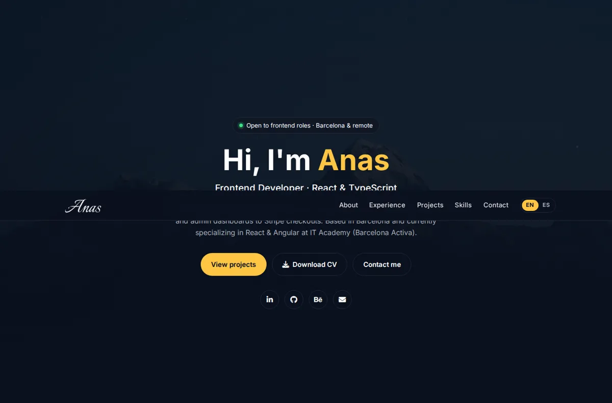

# Anas Alnagar · Frontend Developer

Personal portfolio & CV site — **[anascv.com](https://www.anascv.com/)**



React & TypeScript developer based in Barcelona, with a background in UI/UX design.
The site presents my experience, featured projects (each with live demo + source code), skills and contact details, in **English and Spanish**.

## Tech stack

- **React 18** + **Vite**
- Plain CSS with design tokens (no UI framework) + Bootstrap grid only
- Bilingual content via a small React Context (`EN` / `ES`, auto-detected from the browser)
- AOS for scroll animations, Font Awesome icons
- Deployed on **Vercel** (with Speed Insights)

## Project structure

```
src/
├── data/content.js          # ALL site content (texts EN/ES, experience, projects, skills)
├── i18n/LanguageContext.jsx # language state + toggle
├── components/              # Navbar, Hero, About, Experience, Projects, Skills, Contact, Footer
└── styles/portfolio.css     # all styles
public/
├── projects/                # optimized WebP screenshots
├── certifications/          # certificate files
└── AnasCvfrontEndEs.pdf     # downloadable CV
```

To add a project, job or skill, edit **only** `src/data/content.js`.

## Run locally

```bash
npm install
npm run dev      # http://localhost:5173
npm run build    # production build in dist/
npm run lint
```

## Contact

[LinkedIn](https://www.linkedin.com/in/anaseg/) · [GitHub](https://github.com/onisEg) · [Behance](https://www.behance.net/AnasEg) · anasdesigneruiux@gmail.com
